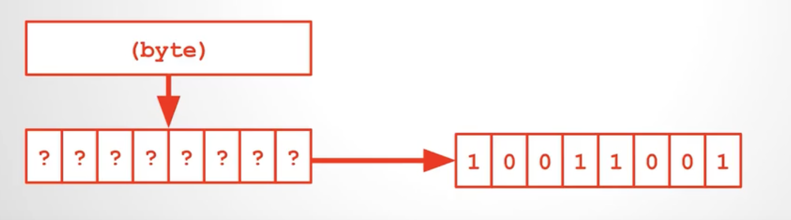

# 整数类型

1个字节Byte由8个比特位Bit组成，台湾话位元组=字节=Byte，位元=比特位=Bit

1个字节Byte存储的数字就是2的8次方，如下：
- 无符号：0 ~ 255，即范围是0 ~ $2^{8}$-1，即255对应2进制的11111111
- 有符号：-$2^{8}$ ~ $2^{8}$-1，即-128 ~ 127

短整数short int，2个字节
- 无符号unsigned short int：0 ~ $2^{16}$-1，即0 ~ 65535
- 有符号signed short int或short ing：-$2^{15}$ ~ $2^{15}$-1，即-32768 ~ 32767

int就是4个字节，即32个Bit
- 无符号unsigned int：0 ~ $2^{32}$-1，即0 ~ 4294967295
- 有符号signed int或int：-$2^{31}$ ~ $2^{31}$-1，即 -2147483647 ~ 2147483648

