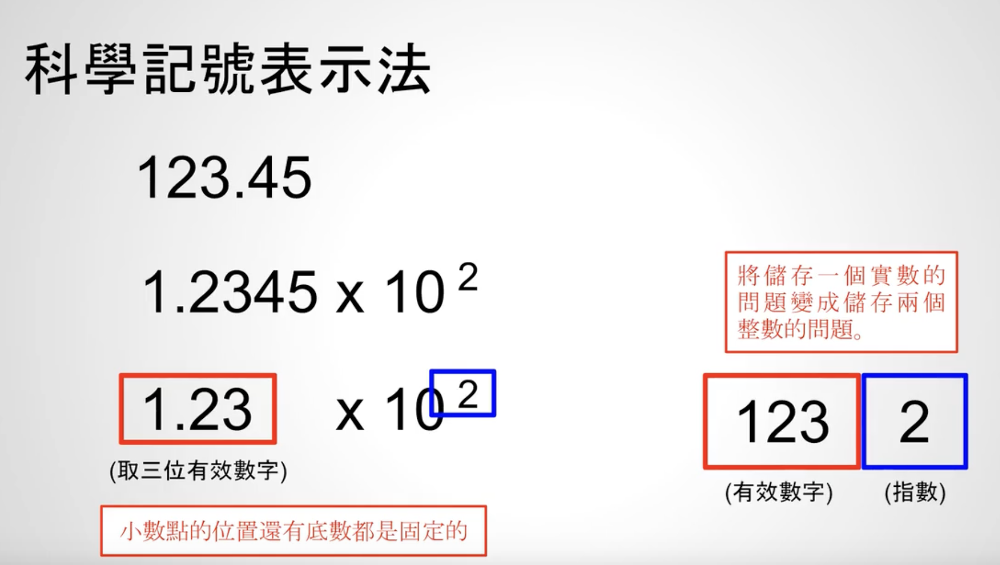

# 浮点类型

在占用同样存储空间的情况下，浮点数表示的范围大于整数表示的范围，比如用
4个字节来表示，整数大概是10位数（-2147483647 ~ 2147483648），浮点数
大概是40位数

浮点数可以想象为科学计数表示法

科学计数法表示123.45 = 1.2345 * $10^{2}$，存储的时候只需要存储123和指数2即可，如下图：



浮点数表示法的概念：


C语言常见的浮点数类型：float和double
- float：4字节，有效数字为6，指数为8
- double：8字节，有效数字为15，指数为11


IEEE 754浮点数标准，当前主流的float和double标准

🧠 一、float 和 double 的结构
✅ float（单精度，32 位 / 4 字节）：

| Bit 位范围         | 含义        |
|--------------|-----------|
|bit 31（最高位）| 符号位 S     |
|bit 30~23| 指数 E（8 位）    |
|bit 22~0| 尾数 M（23 位）     |


实际有效精度是 24 位（最前面隐藏一个 1，称为 隐含位）。

✅ double（双精度，64 位 / 8 字节）：

| Bit 位范围         | 含义        |
|--------------|-----------|
|bit 63（最高位）| 符号位 S     |
|bit 62~52| 指数 E（11 位）    |
|bit 51~0| 尾数 M（52 位）     |

实际有效精度是 53 位（同样有 1 个隐含位）。


🔹float 的 32 位结构（从左到右：高位到低位）
```mathematica
| S |     指数 (8 bits)     |         有效数字 (23 bits)        |
|31 | 30 29 28 27 26 25 24 23 22|21 ...                      ... 0  |
```

🔹double 的 64 位结构：
```mathematica
| S |       指数 (11 bits)        |                 有效数字 (52 bits)                 |
|63 | 62 61 60 ...         ...       52| 51 ...                                ...        0 |
```

# IEEE 754 浮点数格式（C语言）

| 类型         | 总字节数 | 符号位 | 指数位 | 有效数字位（尾数） | 实际有效位数 | 能准确表示的最大整数范围   |
|--------------|-----------|--------|--------|---------------------|----------------|-----------------------------|
| float        | 4 字节     | 1 位   | 8 位   | 23 位                | 24 位（含隐含1） | ±2²⁴ = ±16,777,216         |
| double       | 8 字节     | 1 位   | 11 位  | 52 位                | 53 位（含隐含1） | ±2⁵³ = ±9,007,199,254,740,992 |
| long double* | 编译器定义 | ?      | ?      | ?                   | ?              | 依平台实现，非标准化         |

> 注：
> - 实际有效位数 = 尾数位数 + 隐含的第 1 位。
> - float 在超过 ±2²⁴ 后，整数无法连续表示，会丢失精度。
> - long double 在不同编译器/平台（如 x86 vs ARM）上结构不同，可能是 80-bit、96-bit 或 128-bit。
