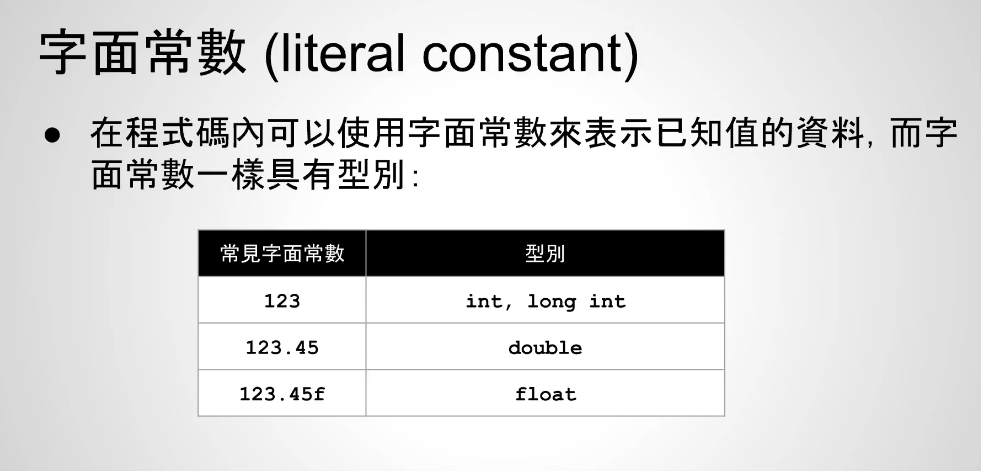
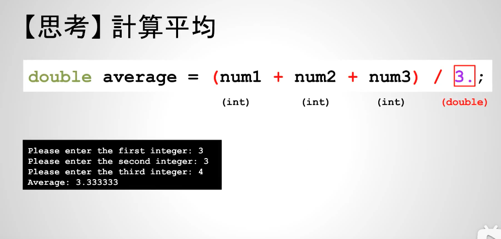
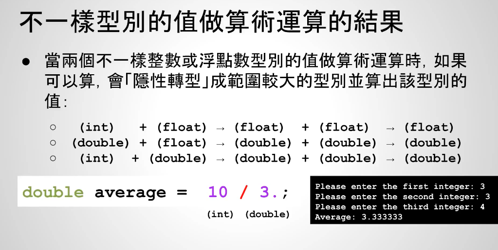

# 整数和浮点数类型的转换


当我们在做算术运算时，计算出来的结果本身也必须要被储存，也会具有数据类型


当整数转浮点数时，如果在可表示的范围里面，会转换成最接近的浮点数值

`3.`其实就是double类型，整数的10除以double类型的3，所以计算结果是double


当2个数据类型不一样的值进行算术运算时，如果可以计算，会隐式转换为范围较大的类型并计算出该类型的值！
如上因为double类型范围比int要大，所以计算结果隐式转换为double类型

隐式转换方向：



隐式转换和显示转换
- 显示转换：人为指定转换类型
```c++
// 隐式转换
double average = (num1 + num2 + num3) / 3.;

// 显示转换，人为告诉是什么类型
double average = (num1 + num2 + num3) / (double) 3;
```