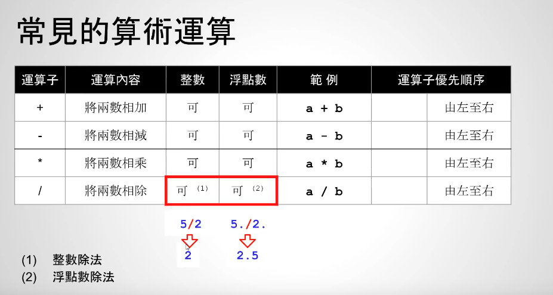
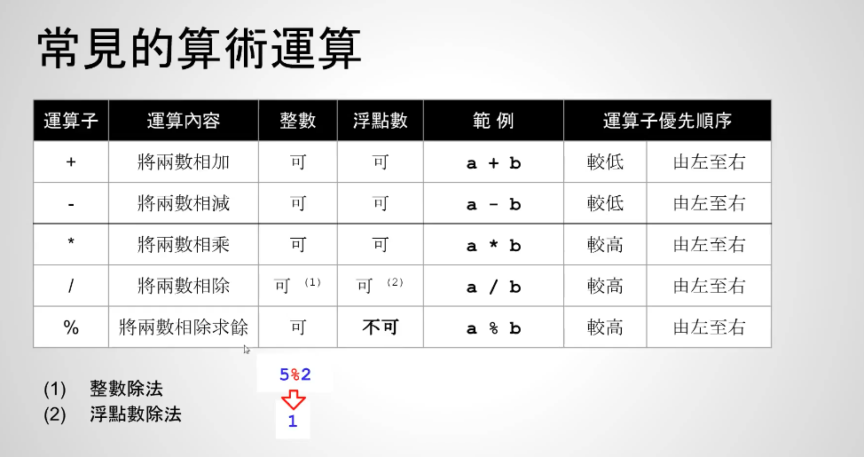

# 整数与浮点数算术运算

在大多数平台（IEEE 754标准），float类型占4字节（32位），double类型站8字节（64位）
- float：单精度浮点数
- double：双精度浮点数


整数相除是整数，浮点数除以整数是浮点数


示例：2*3/4为1，1+1-5=-3
```c++
    // -3
    printf("sum = %d\n", 1 + 2 * 3 / 4 - 5);
```

`%`这个符号只能用于整数之间，不能用于浮点数，比如`5%2` = 1



`%`作用：可以用判断奇数偶数
- 奇数：某个整数%2 = 1
- 偶数：某个整数%2 = 0