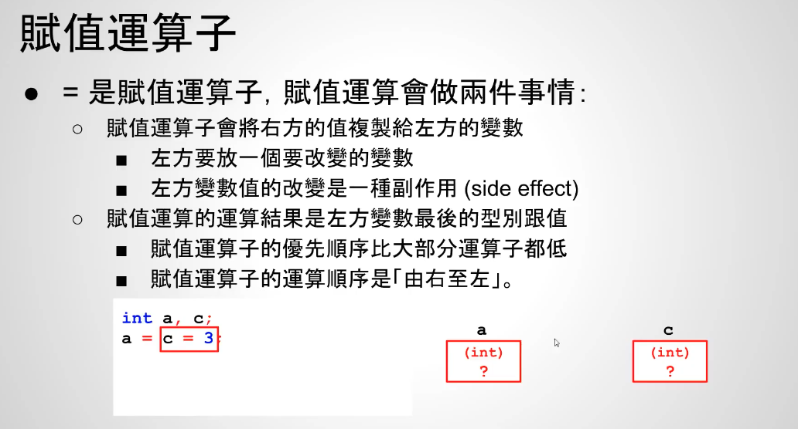
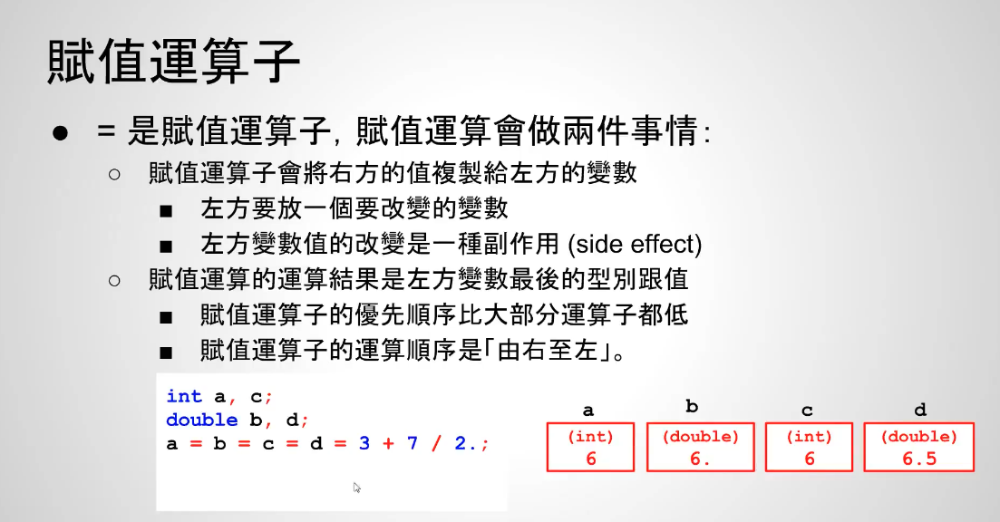

# 赋值运算

赋值运算符：
- 赋值运算符的优先顺序比大部分运算符都低
- 赋值运算符的运算顺序是由右至左

```c++
   int a, c;
    // 先计算c=3，再计算a=c
    a = c = 3;
```

如下：



案例2：非常重要：
1. 首先计算3 + 3.5 = 3.0 + 3.5 = 6.5
2. 继续计算 a = b = c = d = 6.5
3. c是int，6.5是double，类型不一样，所以double转int（无条件舍弃小数部分），所以c=6
4. 计算a = b = 6，因为b是double，所以int转double，变成6.0
5. 最后计算a=6.0，所以是6
6. 综上所述 a=6,c=6，b=6.000000,d=6.500000


```c++
    int a, c;
    double b, d;
    a = b = c = d = 3 + 7 / 2.;
    // a=6,c=6
    printf("a=%d,c=%d\n", a, c);
    // b=6.000000,d=6.500000
    printf("b=%f,d=%f\n", b, d);
```


