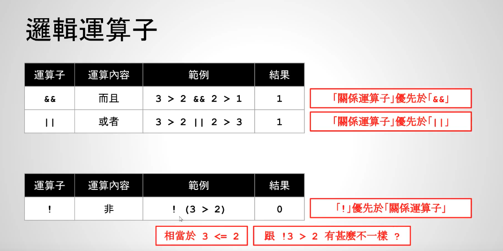

# viedo37-逻辑运算


关系运算符优先级高于逻辑运算符，比如 3 > 2 && 2 > 1，&&最后计算

短路求值：如果逻辑运算符左边计算出的结果已经不满足了，右边的可以不用计算，比如 2 > 3 && 2 > 1，
因为2 > 3已经是0了，所以计算出的结果就是0




- !(3>2)等价于3<=2，所以输出是0
- 那么!3 > 2输出是什么？因为!优先级高，所以!3是0，再计算0>2输出也就是0

输出结果如下：
```c++
     // 1
    printf("the result is %d\n", 3 > 2 && 2 > 1);
    // 0
    printf("the result is %d\n", 2 > 3 && 2 > 1);
    // 0
    printf("the result is %d\n", !(3 > 2));
    // 1
    printf("the result is %d\n", !(1 > 2));
    // 0
    printf("the result is %d\n", !3 > 2);
```