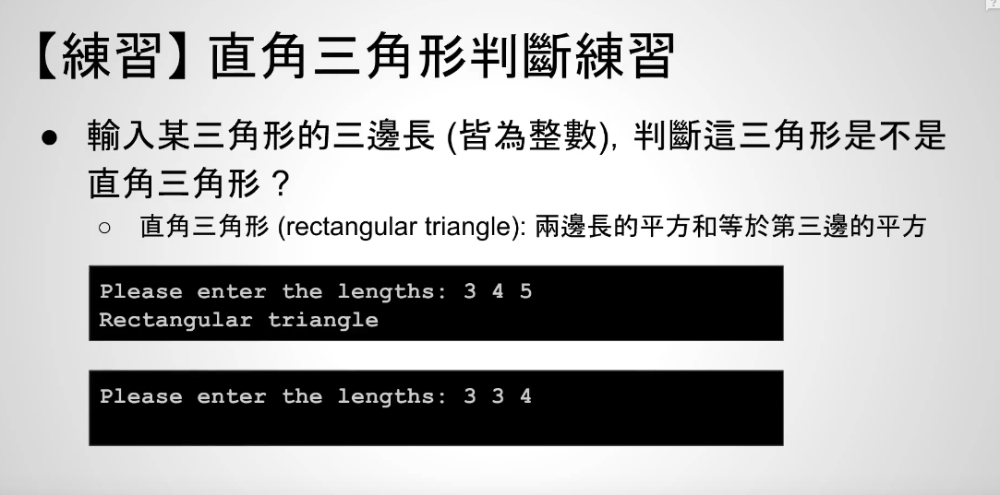

# video-45 直角三角形判断练习（if语句）





C语言中的平方运算
```c++
#include <math.h>

a = pow(底数,幂);
```

比如pow(2,3)就是2的3次方，注意`pow()`方法返回值是double类型

```c++
// 直角三角形判断

#include <math.h>
#include <stdio.h>

int main() {
  int side1, side2, side3;
  printf("Please enter the lengths: ");
  scanf("%d%d%d", &side1, &side2, &side3);
  // pow()返回浮点数
  if (pow(side1, 2) == pow(side2, 2) + pow(side3, 2) ||
      pow(side2, 2) == pow(side2, 2) + pow(side1, 2) ||
      pow(side3, 2) == pow(side1, 2) + pow(side2, 2)) {
    printf("Rectangular triangle\n");
  }
  return 0;
}
```