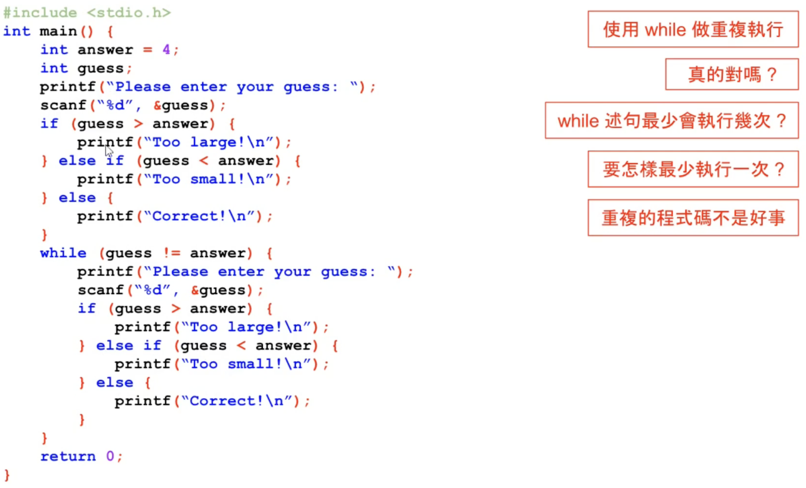

# 09-02 猜数字练习（while语句）

while最少执行0次

下面这种情况，让guess先执行1次赋值，代码显得臃肿，不是一个好办法


优化后的代码：作者认为这也不是一个非常好的写法
```c++
#include <stdio.h>

int main() {
  int answer = 4;
  int guess;
  // 先执行1次
  printf("Please enter your guess: ");
  scanf("%d", &guess);
  // 有了初始值继续执行
  while (guess != answer) {
    if (guess > answer) {
      printf("Too large\n");
    } else if (guess < answer) {
      printf("Too small\n");
    }
    printf("Please enter your guess: ");
    scanf("%d", &guess);
  }
  printf("Correct\n");
  return 0;
}
```