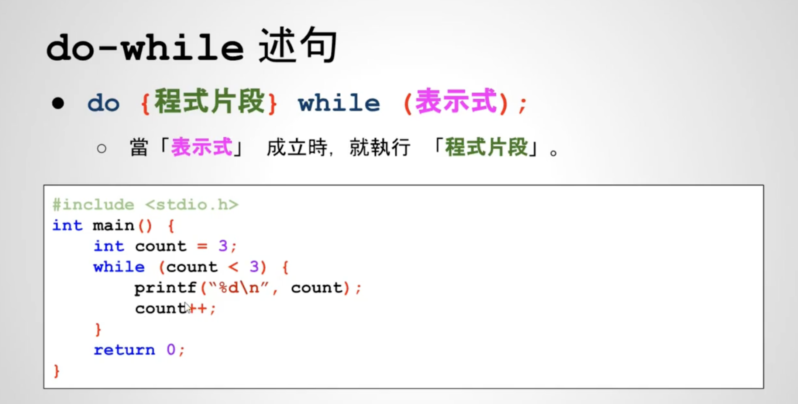

# 09-07 至少做一次的重复执行（do-while语句）

do-while语句很少用
- while后面是分号

猜数字优化：至少执行1次
```c++
int main() {
  int answer = 4;
  int guess;
  do {
    printf("Please enter your guess: ");
    scanf("%d", &guess);
    if (guess > answer) {
      printf("Too large！\n");
    } else if (guess < answer) {
      printf("Too small\n");
    } else {
      printf("Correct！");
    }
  } while (guess != answer);
  return 0;
}

```


