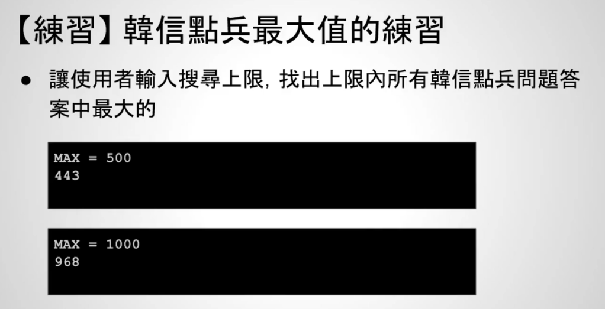

# 11 - 04 ｜ 韓信點兵中的最大值問題 (使用 for 述句)


需求


实现方式1：使用while
```c++
int main() {
  int max;
  printf("MAX =  ");
  scanf("%d", &max);

  int number = max;
  // number > 0避免无限循环
  while (number > 0 &&
         !(number % 3 == 2 && number % 5 == 3 && number % 7 == 2)) {
    --number;
  }
  if (number > 0) {
    printf("%d\n", number);
  } else {
    printf("No answer\n");
  }
  return 0;
}
```

实现方式2：使用for
```c++
 // 实现方式2：使用for
  int max;
  printf("MAX =  ");
  scanf("%d", &max);

  int answer = 0;
  int number;
  for (number = max; number >= 1; --number) {
    if (number % 3 == 2 && number % 5 == 3 && number % 7 == 2) {
      // answer永远存放最新的结果
      answer = number;
      break;
    }
  }

  if (answer != 0) {
    printf("%d\n", answer);
  }
```


