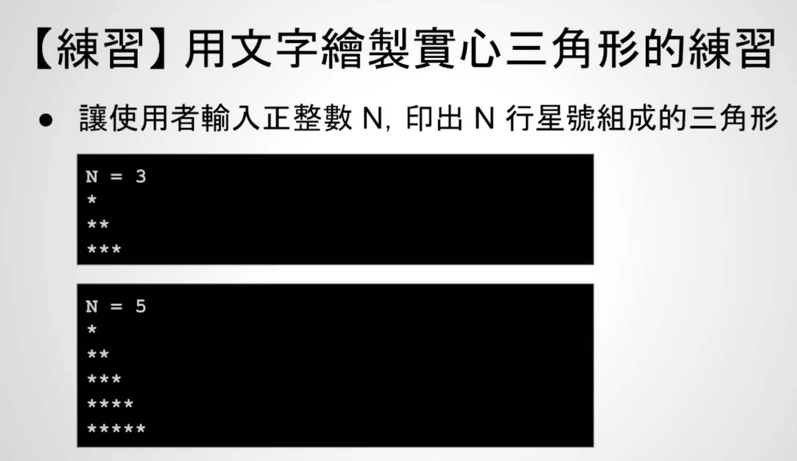

# 12 - 04 ｜ 用文字繪製三角形的練習 (使用 for 述句)

## 需求1

需求1：


需求1的实现方法：
```c++
int main() {
  int N;
  printf("N = ");
  scanf("%d", &N);

  for (int i = 1; i <= N; ++i) {
    for (int j = 1; j <= i; j++) {
      printf("*");
    }
    printf("\n");
  }

  return 0;
}
```

## 需求2

需求2：印出空心三角形


