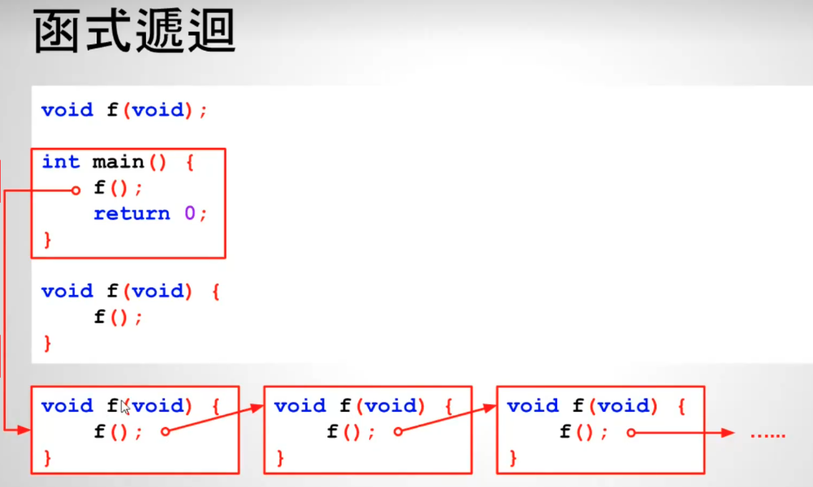
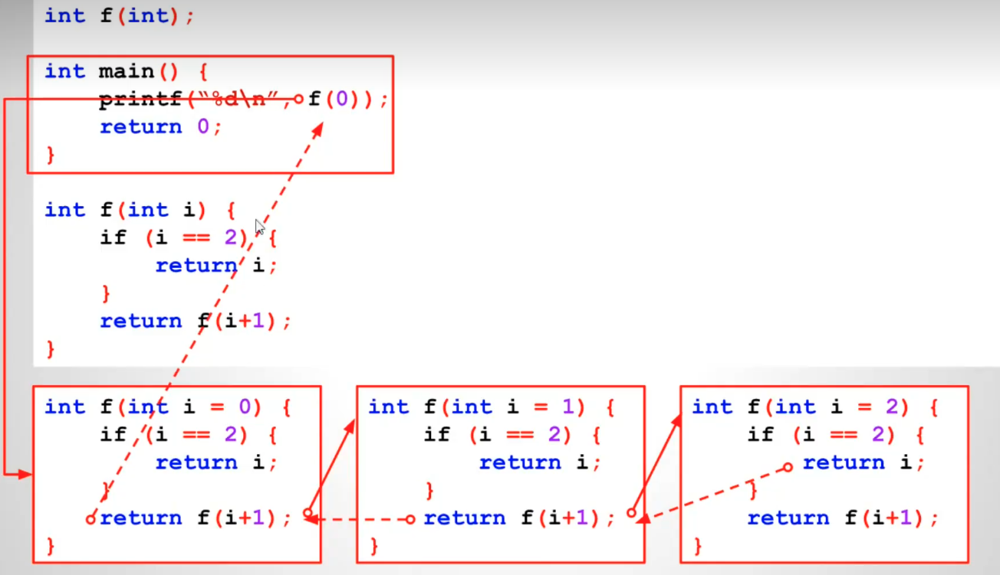

# # 14 - 01 ｜ 函式遞迴

函数递归
```c++
void f(void);

int main() {
  f();
  return 0;
}

void f(void) { f(); }
```

函数递归调用：


如上图
- 在第二个`f`执行的时候，第一个`f`并未结束
- 即`main()`在等第一个`f`结束，第一个`f`在等第二个`f`结束...
- 这样没法正常结束，随着内存耗尽会有未知结果

如下，也是非预期的技术
```c++
#include <stdio.h>

int fn(int);

int main() {
  printf("%d\n", fn(0));
  return 0;
}

int fn(int i = 0) { return fn(i + 1); }
```
以上报错
```shell
Process finished with exit code 139 (interrupted by signal 11:SIGSEGV)

```


所以需要加1个中断条件，如下
```c++
#include <stdio.h>

int fn(int);

int main() {
  printf("%d\n", fn(0));
  return 0;
}

int fn(int i = 0) {
  // 这是递归中断条件
  if (i == 2) {
    return i;
  }
  return fn(i + 1);
}
```

逻辑图如下：

