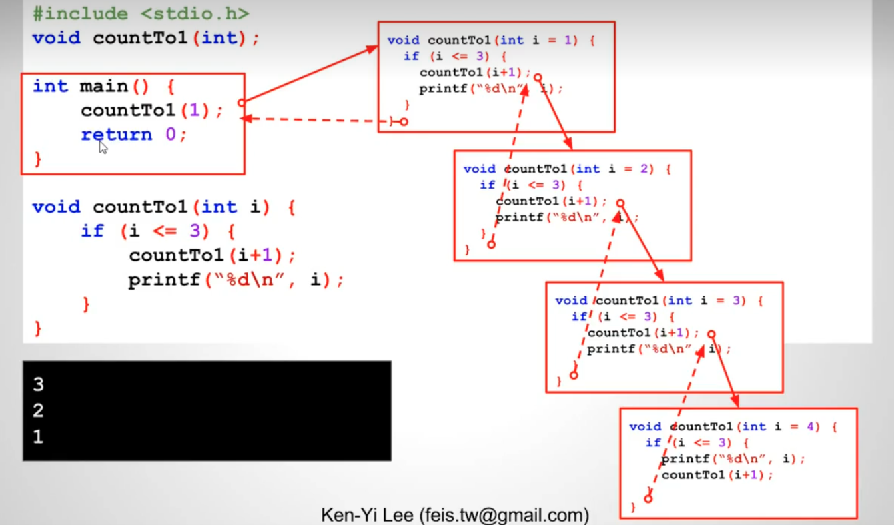

# 14 - 02 ｜ 數數字的練習 (使用函式)

示例1：从1打印到3，用递归
```c++
void countTo3(int);

int main() {
  countTo3(1);
  return 0;
}

void countTo3(int i) {
  // 递归中断条件
  if (i <= 3) {
    printf("%d\n", i);
    countTo3(i + 1);
  }
}
```

示例2：从3到1，使用递归，常规写法
```c++
void countTo1(int);

int main() {
  countTo1(3);
  return 0;
}

void countTo1(int i) {
  // 递归中断条件
  if (i >= 1) {
    printf("%d\n", i);
    countTo1(i - 1);
  }
}
```

示例2的改良写法：重点，多思考
```c++
void countTo1(int);

int main() {
  countTo1(1);
  return 0;
}

void countTo1(int i) {
  // 递归中断条件
  if (i <= 3) {
    // 这时候先递归，等递归条件结束了就开始打印
    countTo1(i + 1);
    printf("%d\n", i);
  }
}
```

逻辑如下图：

