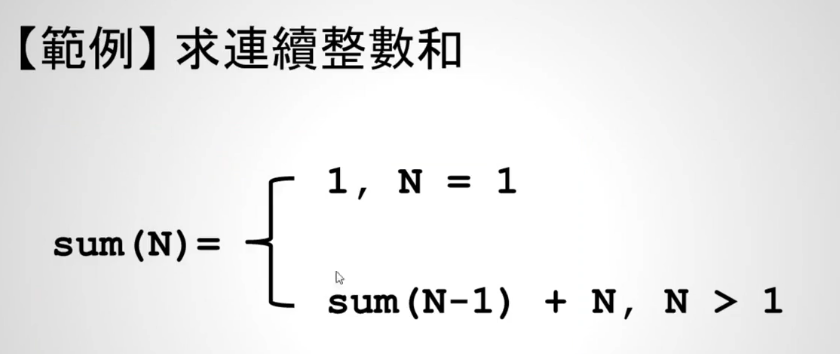

# 14 - 03 ｜ 求連續整數和的練習 (使用函式)

从加到100，自己琢磨版本
```c++
int calc(int);
int sum = 0;

int main() {
  int N;
  printf("enter a number: ");
  scanf("%d", &N);

  int sum = calc(N);
  printf("the sum is: %d\n", sum);
  return 0;
}

int calc(int i) {
  if (i >= 1) {
    sum += i;
    calc(i - 1);
  }
  return sum;
}
```

需求分析：


优化后版本：
```c++
int sum(int);

int main() {
  int N;
  printf("enter a number: ");
  scanf("%d", &N);
  printf("The sum of %d is: %d\n", N, sum(N));
  return 0;
}

int sum(int n) {
  if (n == 1) {
    return 1;
  }
  return n + sum(n - 1);
}
```