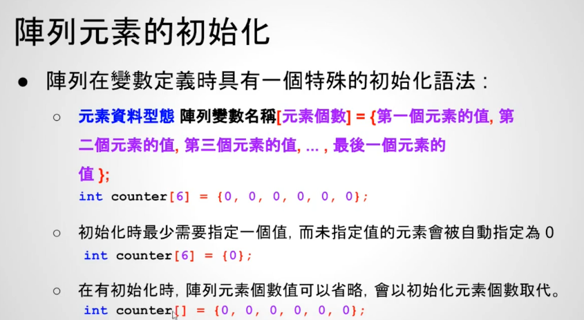

# 15 - 03 ｜ 骰子點數出現次數的統計 (使用陣列)

需求：
- 模拟掷6000次骰子，分别显示1到6出现的次数

示例1：之前做法
```c++
int main() {
  // 乱数种子
  srand(time(NULL));
  int counter1 = 0, counter2 = 0, counter3 = 0, counter4 = 0, counter5 = 0,
      counter6 = 0;
  int i;
  for (i = 0; i < 6000; ++i) {
    int dice = rand() % 6 + 1;
    switch (dice) {
    case 1:
      counter1++;
      break;
    case 2:
      counter2++;
      break;
    case 3:
      counter3++;
      break;
    case 4:
      counter4++;
      break;
    case 5:
      counter5++;
      break;
    case 6:
      counter6++;
      break;
    default:
      break;
    }
  }
  printf("counter1 = %d\n", counter1);
  printf("counter2 = %d\n", counter2);
  printf("counter3 = %d\n", counter3);
  printf("counter4 = %d\n", counter4);
  printf("counter5 = %d\n", counter5);
  printf("counter6 = %d\n", counter6);

  return 0;
}
```


数组的初始化方法：


数组的初始化方法1：
```c++
  // 数组的初始化
  int counter[6] = {0, 0, 0, 0, 0, 0};
```

数组的初始化方法2：
```c++
  // 数组的初始化
  int counter[6] = {0};
``` 


示例2：使用数组实现

```c++

```


