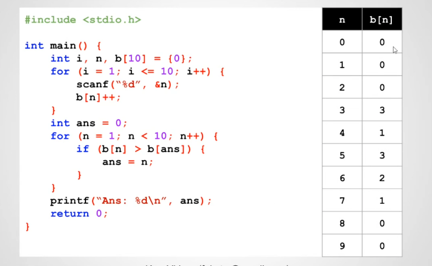

# 16 - 06 ｜ 求小範圍內眾數的練習 (使用陣列)

需求：
- 使用者输入10个0-9之间的整数后，输出出现次数最多的数字
- 当有2个数字出线数量相同多的时候，输出数值大的数字

对应关系如下图：


数组的初始化
```c++
 // b[0] ~ b[9]都是0
 int b[10] = {0};
 // c[0]是0，c[1]是1，c[2] ~ c[9]都是0
 int c[10] = {0,1};
 // d[0]是1，d[1] ~ d[9]都是0
 int d[10] = {1};
```
