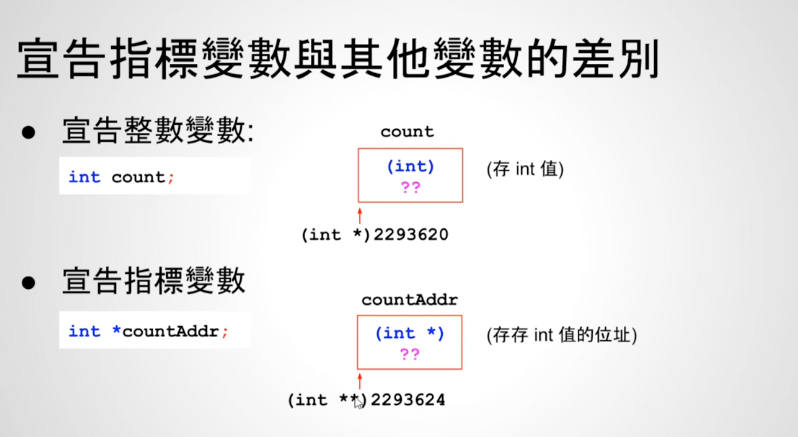
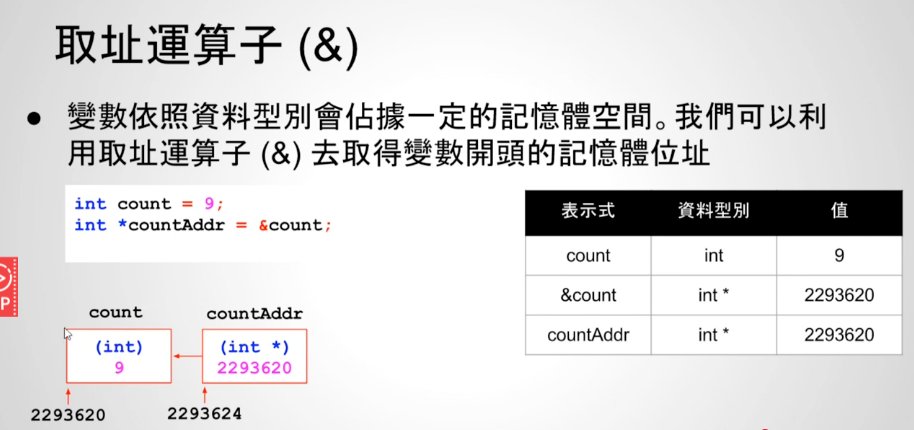
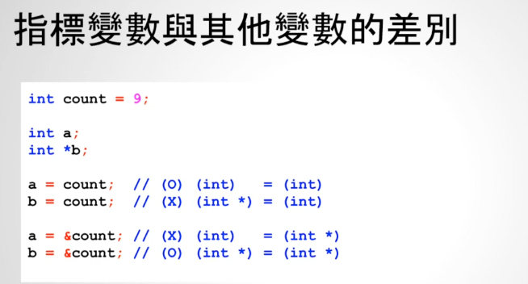

# 23 - 02 ｜ 指標變數宣告與取址運算

指针定义语法：
```aiignore
数据类型 *变数名称;
```
- 表示变数内存放的是1个存放这种“数据类型”值的“内存地址”

```c++

// 定义整数
int count;

// 定义指针变量，countAddr存放的是int *
int *countAddr;
```

- 其中count是int，那么它的位置就是`(int *)`，countAddr存放的就是2293620
- `int **`最右边的`*`表示这存的是1个内存地址，地址里面的数据类型是`int *`

总结，对于`count`变量来说
- 里面存放的是int类型
- `count`的内存地址是`int *`，表示是存放整数类型的内存地址

对于`countAddr`来说
- 里面存放的是存放`int`类型的地址，也就是`int *`
- `countAddr`的内存地址是`int **`，表示存放存放整数类型的内存地址，如下图所示


[
]()

存放好了，如何取值？用取地址运算符`&`
```c++
int count = 9;
// 获取count变量的地址
int *countAddr = &count;
```

如下图所示：
[
]()

赋值的时候类型一定要相同：
[
]()