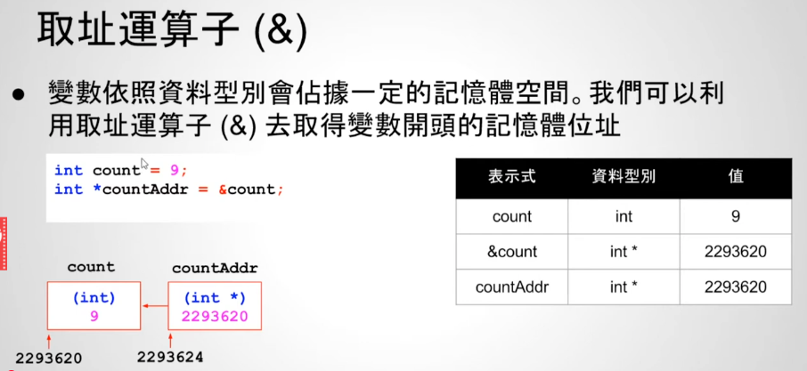
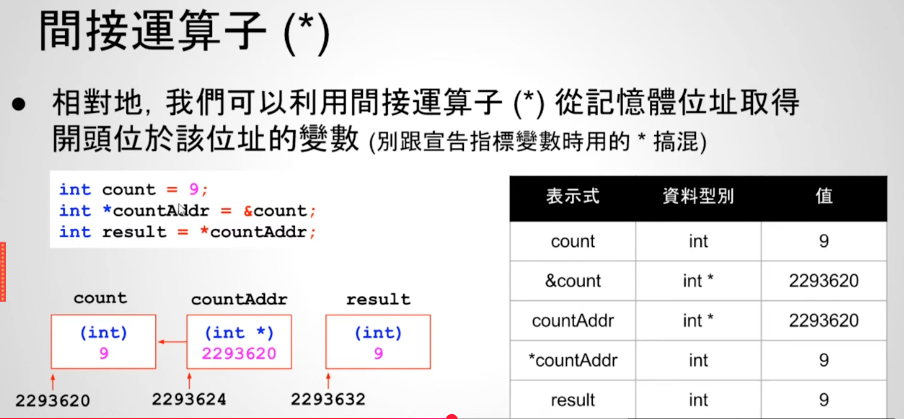
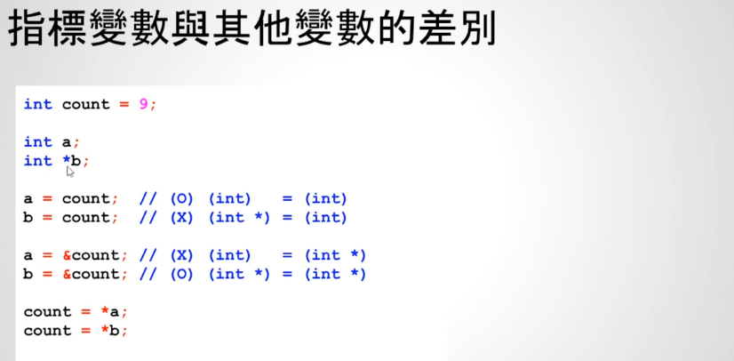
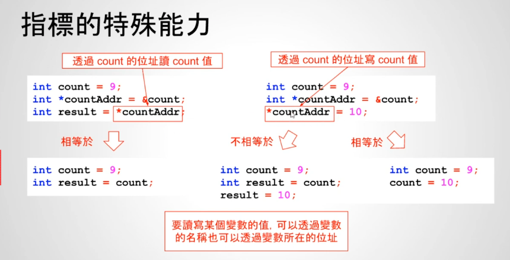
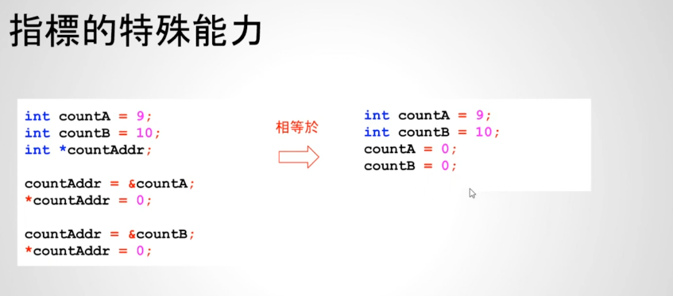
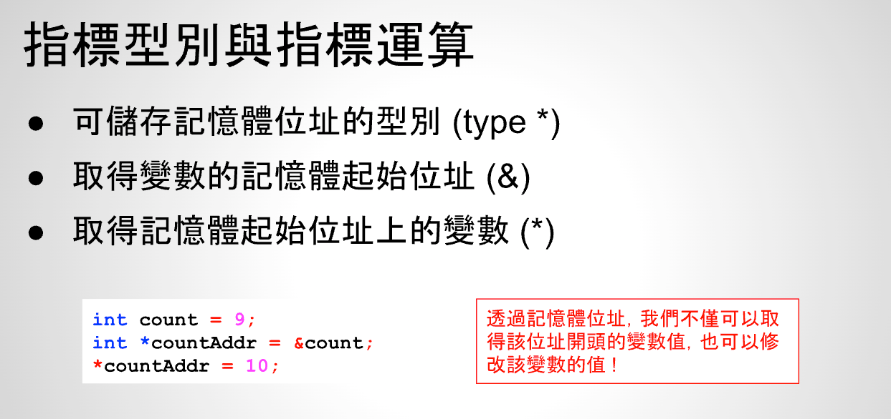

# 23 - 03 ｜ 指標間接運算

运算符：
- 取址运算符`&`：获取某个变量的地址，变量依据数据类型会占据一定的内存地址，我们可以利用取址运算符`&`取获取变量开头的内存地址
- 间接运算符`*`：相对的，我们可以利用间接运算符`*`从内存地址取得开头位于该内存地址的变量（主要不要和声明指针时用的`*`混淆）

取址运算符：

间接运算符：注意蓝色`*`和虹色`*`是不一样的含义
- 蓝色`*`：指针声明，表明countAddr是`int *`类型，也就是指针
- 红色`*`：是间接运算符，因为countAddr里面地址是2293620，所以取2293620这个内存地址的数值，也就是9，注意取值的时候，间接运算符前面的*前是没有类型的！

间接运算符：

指针与其它变量的区别

指针的特殊能力：
- 通过变量count的位置读取count的值
- 通过count的位置写count的值
总结：要读写某个变量的值，可以通过变量的名称`count`去读取，也可以通过变量所在的地址读取`*countAddr`

总结：

