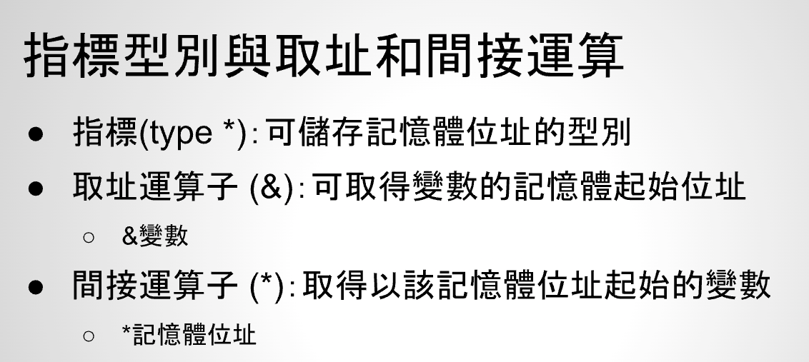
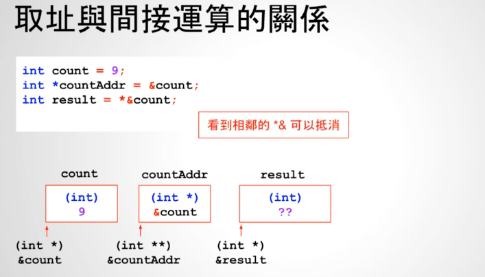

# 23 - 04 ｜ 更多指標與取址間接運算的細節


上堂课总结：


指标对数据类型是非常重要的，比如下面`countAddr`是`int *`类型，才能赋值`&count`

相邻的`*`和`&`可以抵消，及取地址运算符和间接运算符抵消
```c++
int count = 9;
// 这里的*是int类型变量指针声明
int *countAddr = &count;

// 这里的*是间接运算符
int result = *countAddr;

// 等同于
//int result = *&countAddr;
//int result = count;

```

如下：

