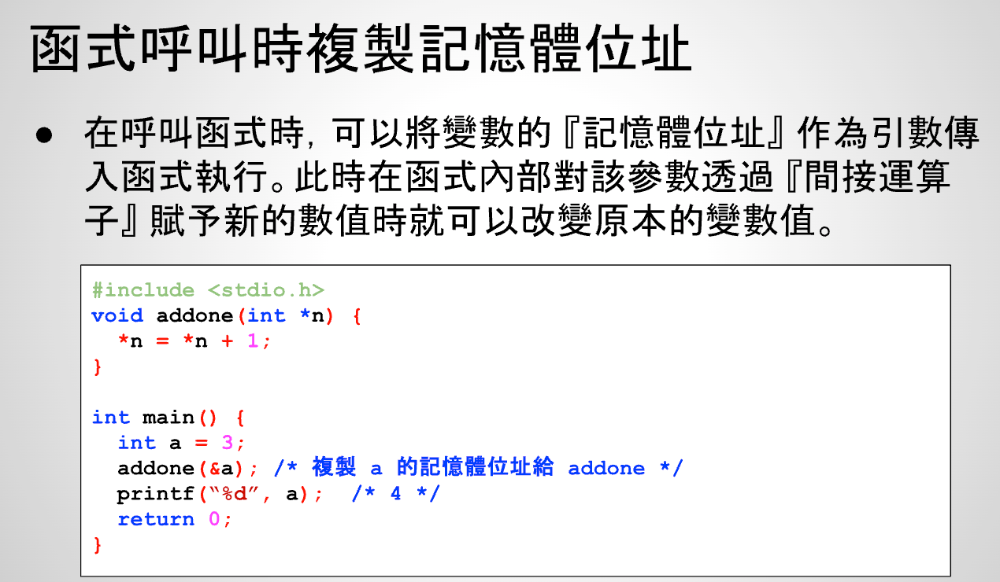

# 24 - 01 ｜ 指標與函式呼叫（重点）

在函数调用时，可以将变量的内存地址作为参数传入函数执行。此时在函数内部该变量通过简介运算符`*`赋予新的数值时就可以改变原来的变量值

通过传递int变量内存地址，改变原来int变量的数值
- 注意addone里面的参数`int *n`，其中`*n`就是main里面的变量a的数值，`n`是变量a的内存地址
- 等于找到了变量a的内存地址（也就是房间），然后把房间里的数值+1变成了4

