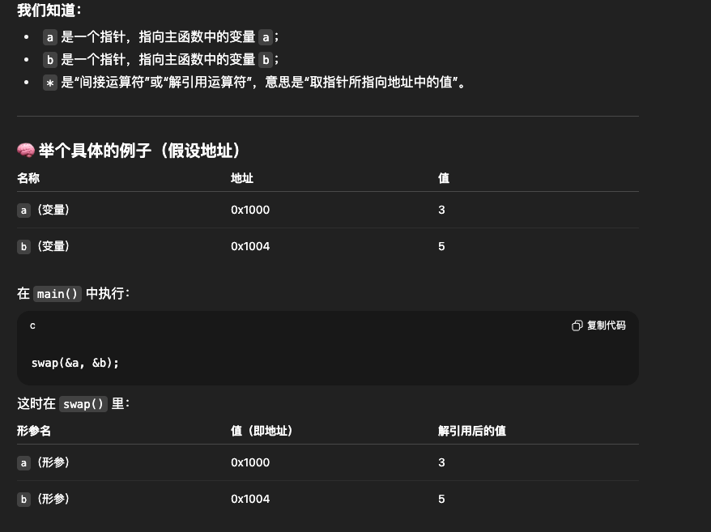
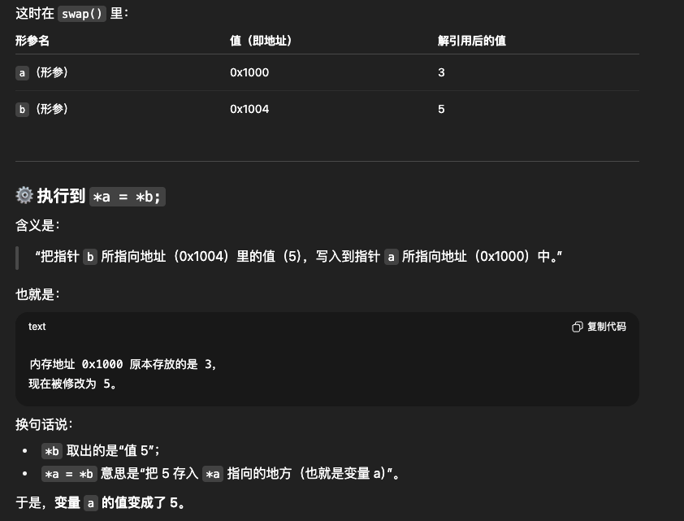

# 24 - 02 ｜ 兩個變數數值交換 (使用函式)


如下：
- swap的2个参数类型都是`int *`，即整型指针
- swap方法接收2个整型变量的地址，并通过指针操作修改他们的实际值
```c++
void swap(int *, int *)
```

主函数执行逻辑：
- `&a`表示取整型变量a的地址，类型是`int *`
- 调用swap方法时，实际是将a和b两个变量的地址传给swap函数
- 这样swap函数中就可以直接修改a和b的值，而不仅仅是副本
```c++
int a=3,b=5;
swap(&a, &b);
```

swap函数内部实现
- 首先注意在swap中，形参a和b是地址
- `int t = *a`：把指针a指向的内容（即变量a的值3）保存到临时变量t中
- `*a = *b`：把指针b指向的内容（即变量b的值5）赋值给*a，此时变量a变成5，也就是把形参b地址里面的数值赋值到形参a地址的空间
- `*b = t`：把临时变量t（原a的值3）赋值给*b，此时变量b变成 3

```c++
void swap(int *a, int *b){
int t = *a;
*a = *b;
*b = t;
}
```


具体逻辑如下：




完整代码：把swap方法中形参名改了下
```c++
// 声明
void swap(int *x, int *y);

int main() {
    int a = 3, b = 5;
    swap(&a, &b);
    printf("a: %d\n", a);
    printf("b: %d\n", b);
    return 0;
}

void swap(int *x, int *y) {
    int t = *x;
    *x = *y;
    *y = t;
}
```

