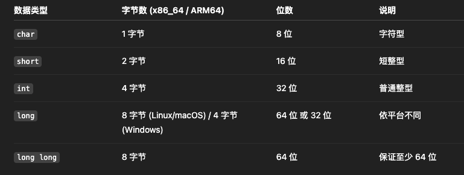
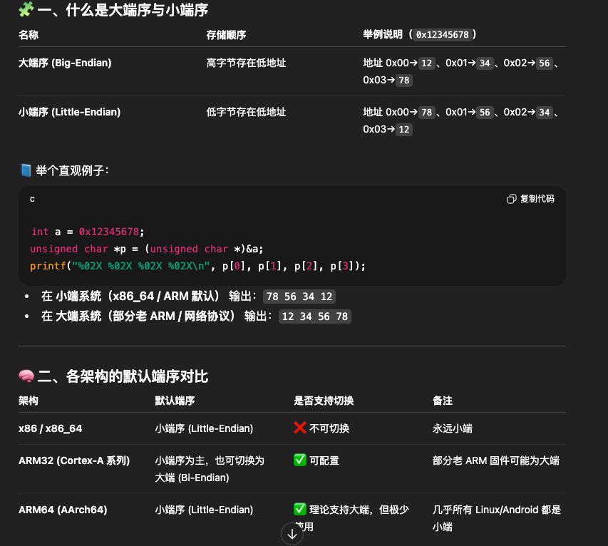
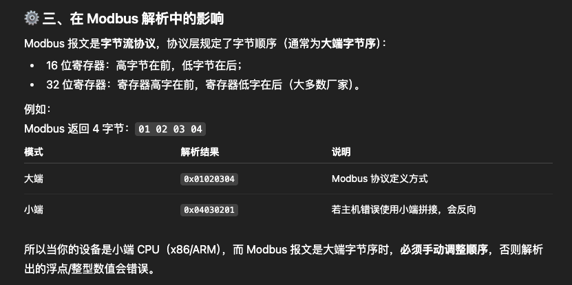
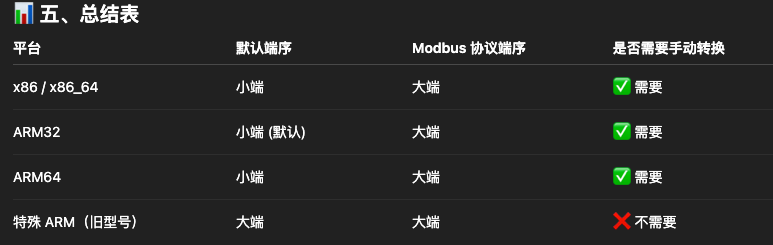

# 24 - 04 ｜ 該傳變數值還是址

## 各平台字节数统计

各平台数据类型占用字节数：


场景假设：
```c++
int a;
int b;
```

其中：b的起始地址 = a的起始地址 + sizeof(int)
- 假设变量a起始地址是2293620，那么占用字节范围就是2293620–2293623
- 变量b的起始地址就是2293624，占用字节范围就是2293624–2293627


## 各平台大端序和小端序

基本概念



modbus影响


在代码中处理方法：手动字节拼接
```c++
uint16_t get_u16_be(uint8_t *buf) {
    return (buf[0] << 8) | buf[1];
}

uint32_t get_u32_be(uint8_t *buf) {
    return (buf[0] << 24) | (buf[1] << 16) | (buf[2] << 8) | buf[3];
}

```

最好在modbus库中统一使用
```c++
// 大端解析
#define READ_U16_BE(buf) ((buf[0] << 8) | buf[1])
#define READ_U32_BE(buf) ((buf[0] << 24) | (buf[1] << 16) | (buf[2] << 8) | buf[3])

```

然后在 procdata_yc_word / procdata_yc_dword 等函数里明确区分：
- byteorder 控制字节序（Endian）；
- wordorder 控制两个寄存器顺序（高/低字寄存器）。

总结：

