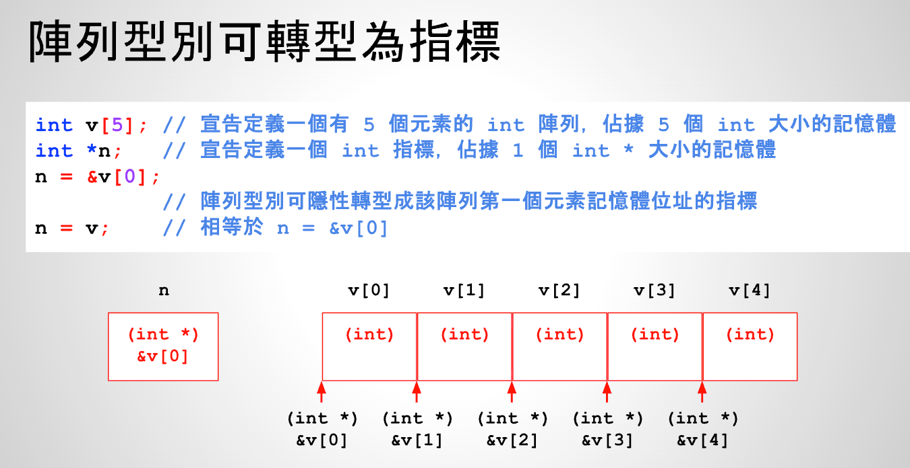
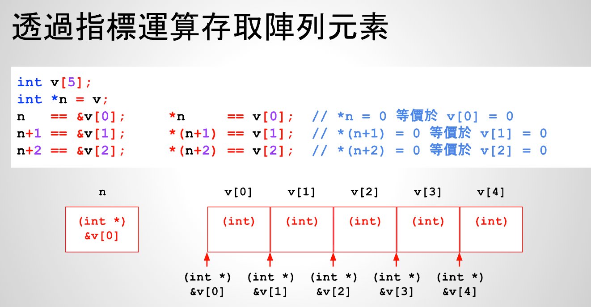

# 25 - 02 ｜ 指標與陣列

整型指针定义：
```c++
// n是1个整型指针，即1个指向int类型数据的指针
int *n;
```

C语言中给你一个整数数组的时候，隐形的帮你转换成数组指针，即第1个整型数组元素的地址
```c++
// 5个元素的整型数组，int类型在x86_64默认是4个字节
int v[5];
int *n;

// 等同于 n = &v[0]，第1个数组元素地址
n = v;
```




示例：
```c++
int main() {
    int v[5];
    int *n;
    n = v;

    printf("n = %d\n", n);
    printf("v = %d\n", v);
    printf("&v[0] = %d\n", &v[0]);


    return 0;
}
```

输出：
```shell    
n = 1871475380
v = 1871475380
&v[0] = 1871475380
```

既然把n定义为了数组v的起始地址，下面就可以进行取值操作



