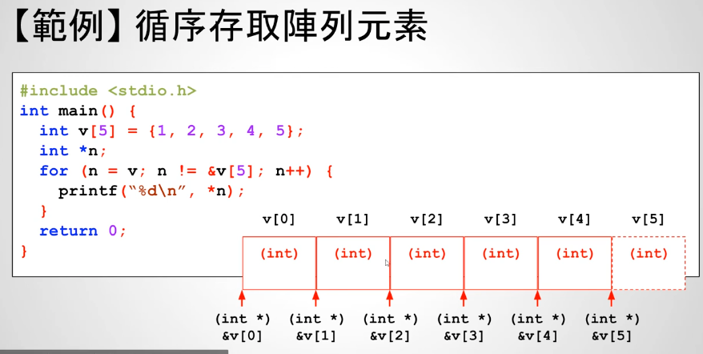

# 25 - 03 ｜ 循序存取陣列元素 (使用指標)


使用数组指针循环打印数组元素：
```c++
int main() {
    int v[5] = {1, 2, 3, 4, 5};
    int *n = v;
    for (int i = 0; i < 5; i++) {
        printf("v[%d] = %d\n", i, *(n + i));
    }

    return 0;
}
```

改进版：
```c++
int main() {
    int v[5] = {1, 2, 3, 4, 5};
    int *n;
    for (n = v; n != v + 5; n++) {
        printf("%d\n", *n);
    }

    return 0;
}
```


