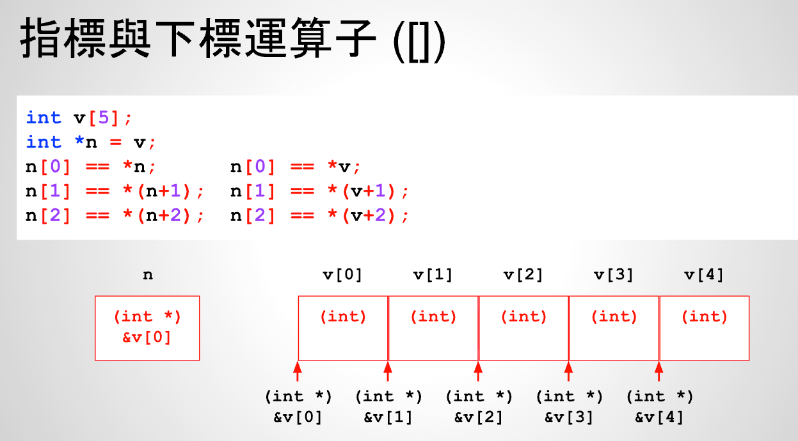

# 25 - 04 ｜ 指標與下標運算子

2个重点：
- 在C语言中，数组名v一般为指向其第1个元素的指针，即`v = &v[0]`
- 在C语言中，`a[b] = *(a+b)`，即`n[0] = *(n+0)`,因为n是int *类型，也是数组v首元素地址，所以`n[0] = v[0]`
  



```c++
int v[5];
// 数组元素0地址赋值给了n，等价于v = &v[0]
int *n = v;

// a[b]就是*(a+b)，n[0]就是*(n+0)，等同于v[0] = 0
n[0] = 0;

// a[b]就是*(a+b), 0[v]就是*（0+v），等同于0+v还是数组v起始位置，所以*(0+v) = v[0]
0[v] = 0;
```

[]可以理解为C语言中的语法糖，即n[0] = v[0]
```c++
int v[5];
int *n = v;

n[0] = *n;
n[1] = *(n+1);
n[2] = *(n+2);


```


