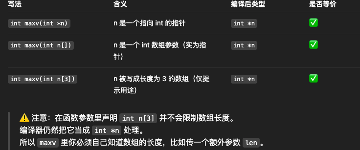

# 25 - 05 ｜ 在函式間傳遞陣列 (使用指標)

## 知识点1

原来3个数字取最大值
- 重点：`int n[]`等价于`int *n`
- 也就是说下面3种写法等价
  ```c++
    int maxv(int *n)

    int maxv(int n[])
  
    int maxv(int n[3])
    ```

完整代码
```c++
int maxv(int *);

int main() {
    int a[3] = {3, 9, 7};
    // 这里参数a等同于&a[0]，即数组a第1个元素地址
    printf("Max：%d\n", maxv(a));
    return 0;
}

// 注意这里int *n 也可以写成int n[]
int maxv(int *n) {
    int max = *(n + 0), i;
    for (i = 1; i < 3; i++) {
        if (*(n + 1) > max) {
            max = *(n + i);
        }
    }
    return max;
}
```

解释如图：



定义一个通用的比大小方法，传入数组首地址和数组长度
```c++
int maxv(int *, int);

int main() {
    int a[3] = {101, 9, 7};
    // 这里参数a等同于&a[0]，即数组a第1个元素地址
    printf("Max：%d\n", maxv(a, 3));
    int b[5] = {3, 9, 7, 108, 99};
    printf("Max：%d\n", maxv(b, 5));
    return 0;
}

int maxv(int *n, int N) {
    int max = *(n + 0);
    for (int i = 1; i < N; i++) {
        if (*(n + i) > max) {
            max = *(n + i);
        }
    }
    return max;
}
```
