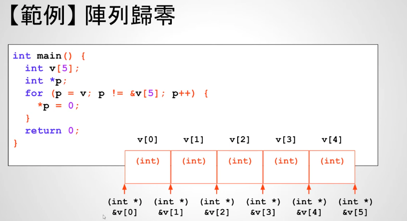
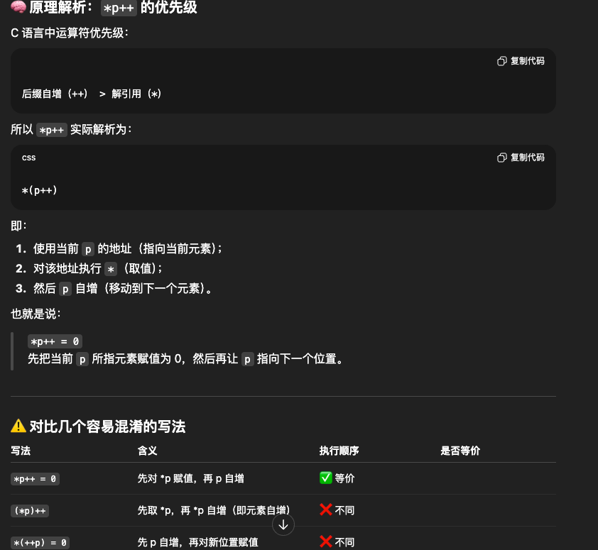
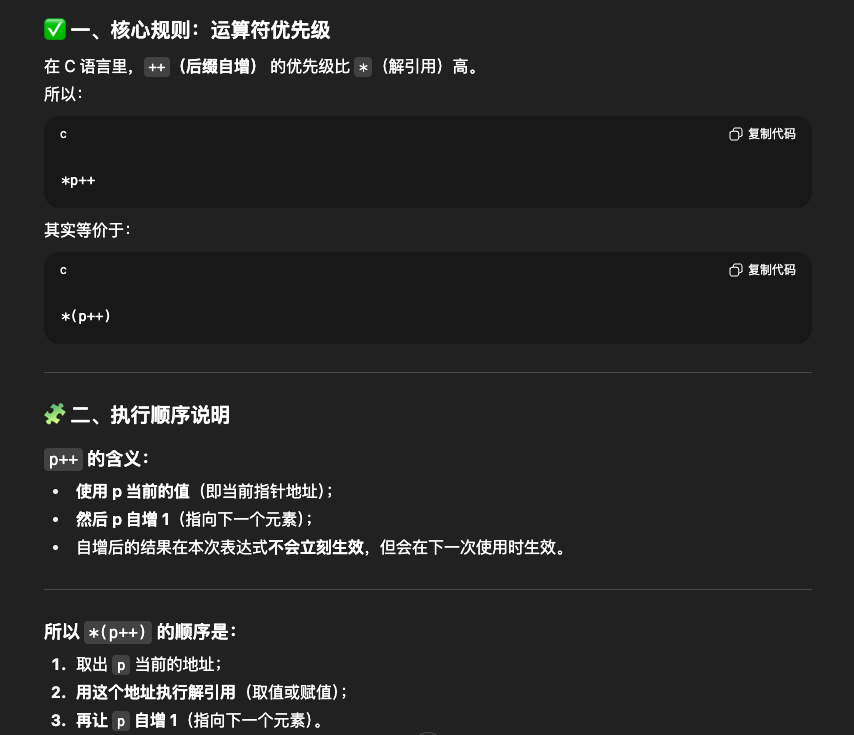

# 25 - 07 ｜ 指標與遞增遞減運算子

阵列归0
```c++
// 通用做法
int v[5] = {0}
```

用指针实现：每个元素置0
```c++
int main() {
    int v[5] = {1, 2, 3, 4, 5};
    for (int i = 0; i < 5; i++) {
        printf("v[%i] = %i\n", i, v[i]);
    }
    printf("Set all elements in array to zero!\n");
    int *p;
    // p != &v[5]等同于p != v+5
    for (p = v; p != &v[5]; p++) {
        *p = 0;
    }
    for (int i = 0; i < 5; i++) {
        printf("v[%i] = %i\n", i, v[i]);
    }

    return 0;
}

```

注意：`v[5]`这个元素不存在，但是`&v[5]`是存在的
- 同时`p != &v[5]`也可以改写成`p != v+5`
- 可以用while继续优化
- 可以简写成`*p++ = 0`，重点理解！

```c++
   int *p = v;
    while (p != v + 5) {
        // 等同于*p++ = 0，先使用p当前的值，即&v[0]，然后再往后挪1位
        *p = 0;
        p++;
    }
```




`*p++`等同于`*(p++)`
- 注意`++`优先级比`*`高
- `p++`表示先使用p当前的值，然后p自增1
原理1：



原理2：



