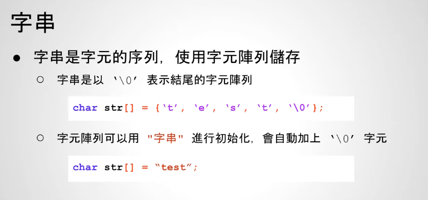

# 26 - 01 ｜ 指標與字串


字符串：



使用：
```c++
    char strA[] = "test";
    char strB[] = {'t','e','s','t','\0'};

    printf("%s\n", strA);  // test
    printf("%s\n", strB);  // test

    char *strC = "test";
    printf("%s\n", strC); // test
```