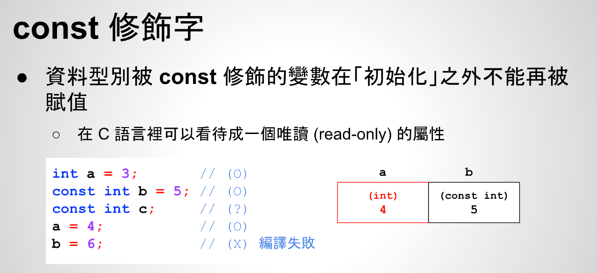

# 26 - 03 ｜ const 修飾字


在C语言中const可以看成read-only属性，不允许被修改


## 对变量使用const修饰符

如下，使用const修饰了变量b，使用指针也不能修改
```c++
  int a = 3;
    const int b = 5;

    a = 4;
    int *c = &b;
    // 编译失败，const修饰的b，这个房间不允许修改
    *c = 6;
    printf("%d\n", b);
    return 0;
```

## 对数组使用const修饰符
对数组使用const定义后，数组元素里面内容不能被修改

