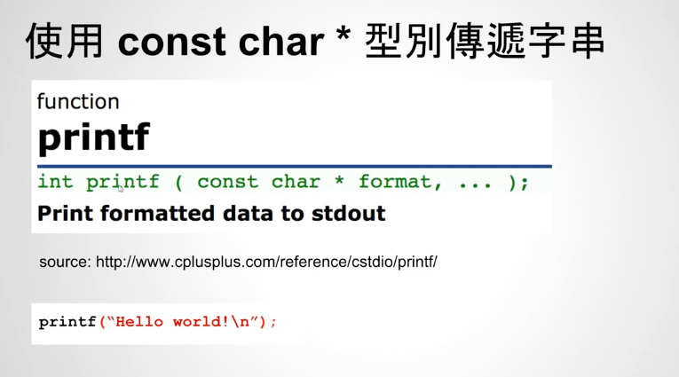
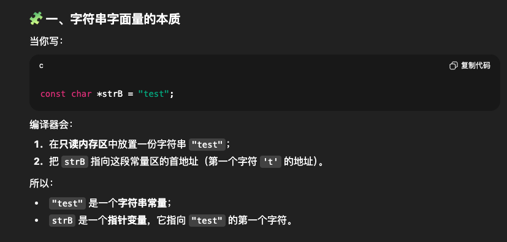
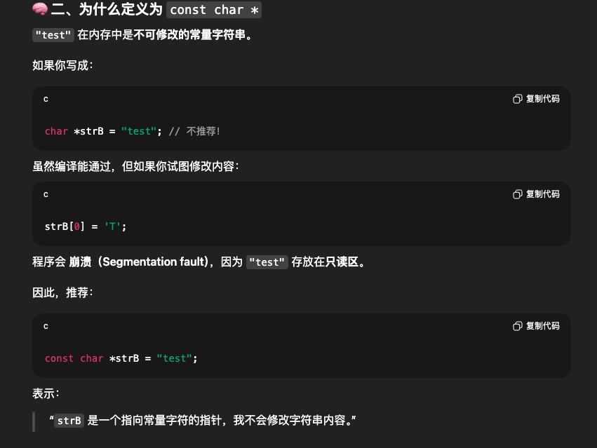
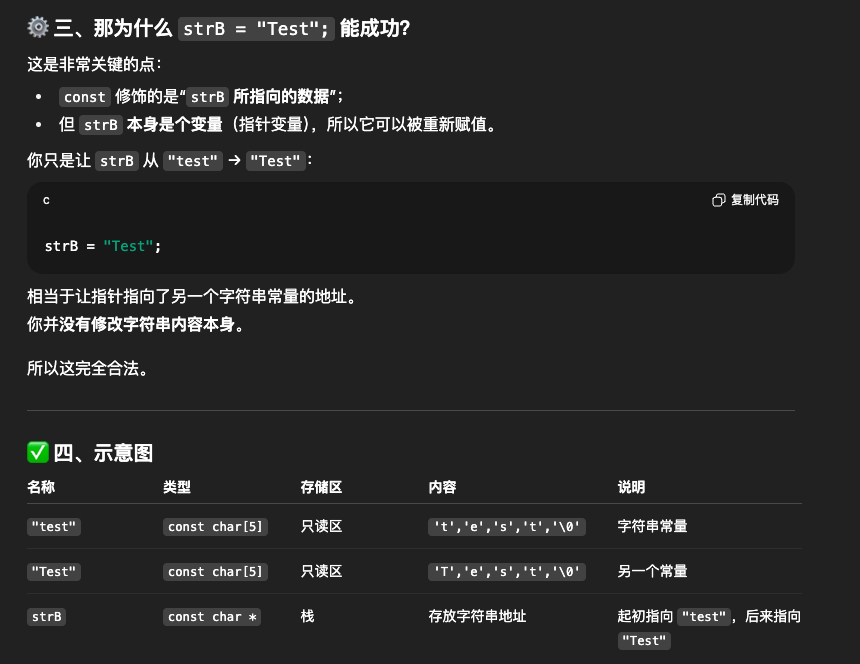
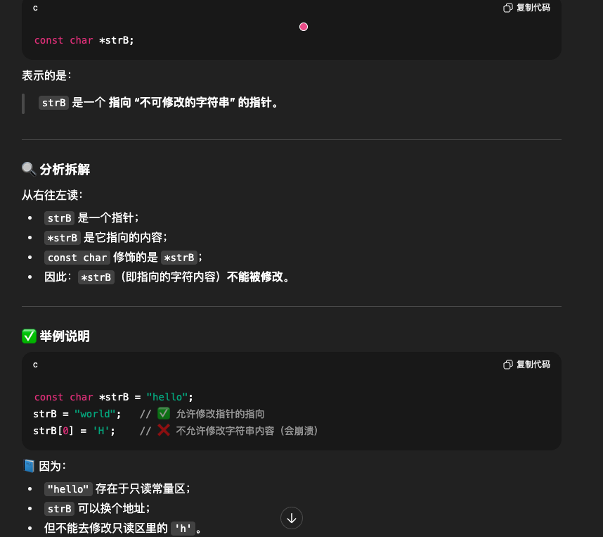
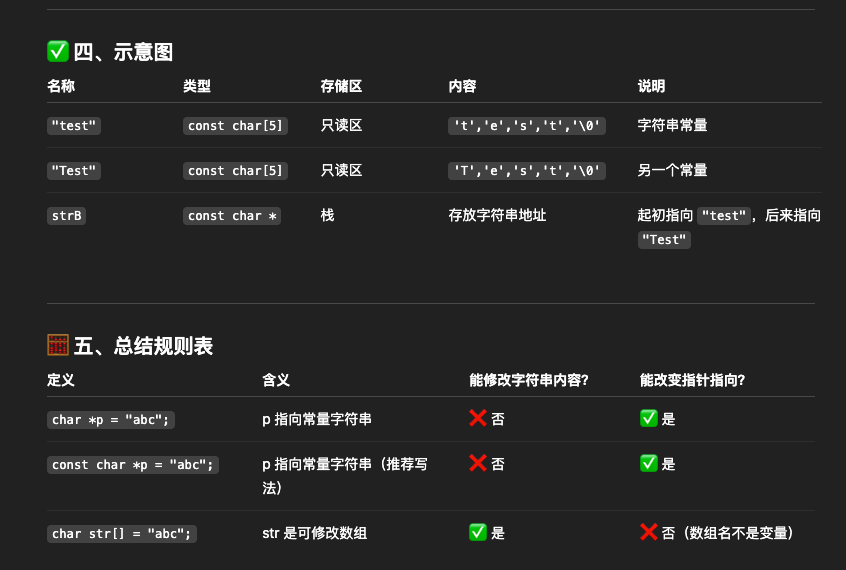
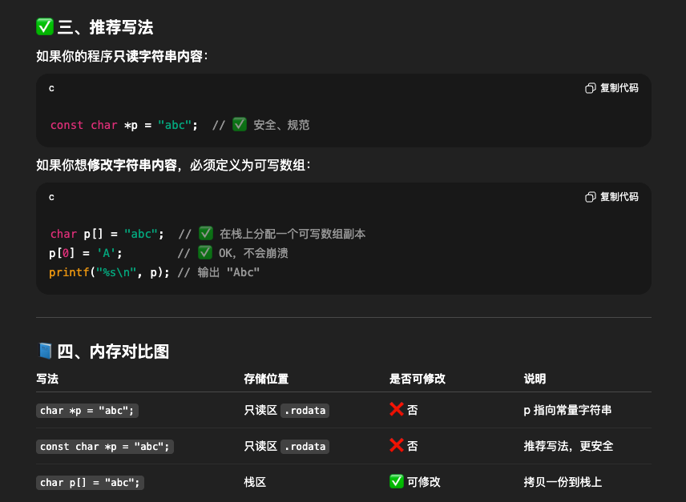

# 26 - 04 ｜ 字串字面常數與 const char *

使用`const char *`来修饰字符串后，那么这个字符串就不能被修改了
```c++
const char *strB = "test";

// 编译错误
strB[0] = 'T';

// 编译正确
strB = "Test";
```


printf方法的参数就是`const char* `



chatgpt总结：
- `strB`是1个`char *`类型，指向”test“的第个字符，即字符串首地址，即`t`的地址


继续：


关键点：
- `strB`是个字符串指针变量`char *`，所以可以重新赋值（更改指向的字符串，将另外的字符串首地址赋值给strB替换掉原来的）



```c++
const char *strB = "test";

```
重点中的重点（个人总结）：
- `const char *strB`等同于`char const *strB`
  - 在C语言中，声明是”从右往左“
  - `cosnt char *strB`说明`strB`是一个指针，该指针指向`const char`，因此是”指向常量字符的指针“
- `const char *strB`这里等于`strB`是一个`const char *`指针，即指向不可更改的字符串，`const char`修饰的是`*strB`




继续：





完整输出效果如下：
```c++
    const char *strB = "test";
    printf("%s\n", strB);  // test
    printf("%c\n", *strB); // t

    strB = "Test";
    printf("%s\n", strB); // Test
    printf("%c\n", *strB); // T
```
