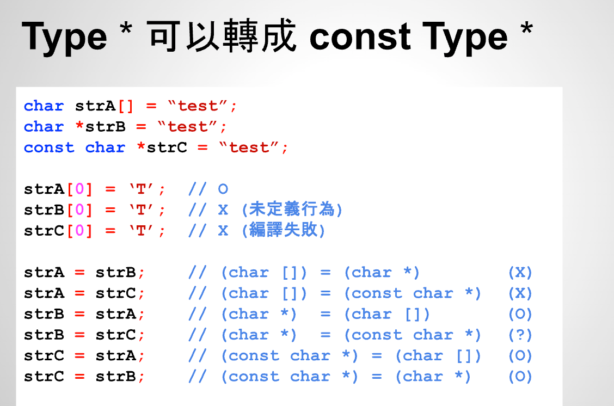
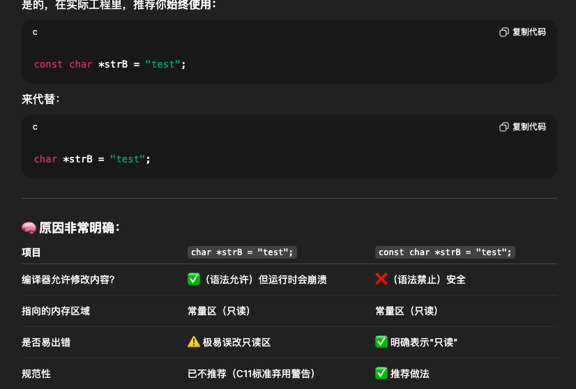
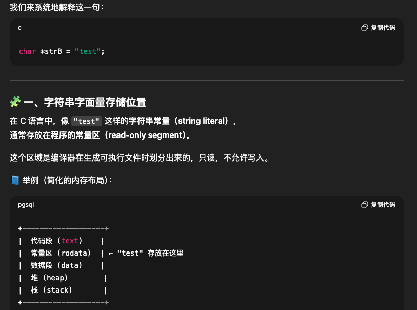
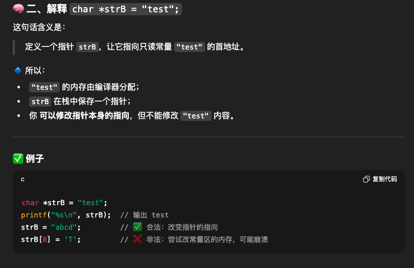
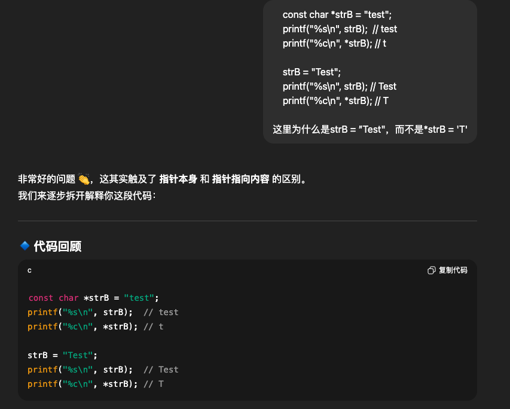
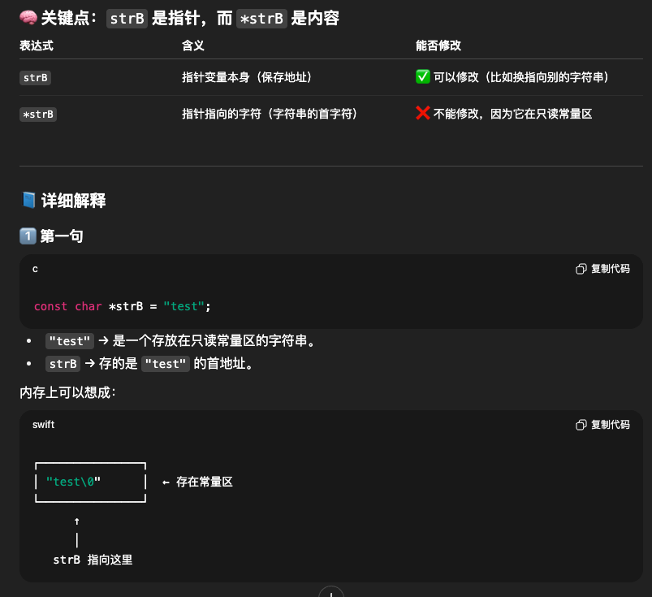
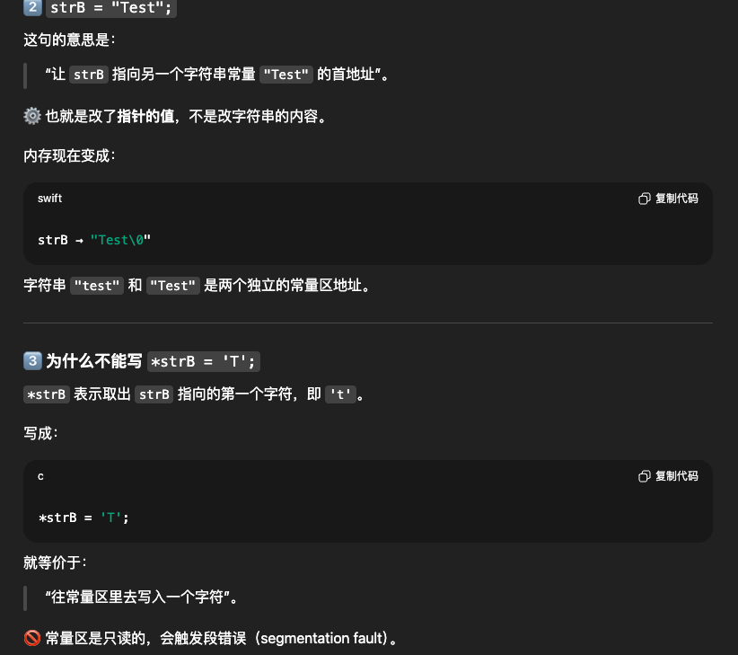
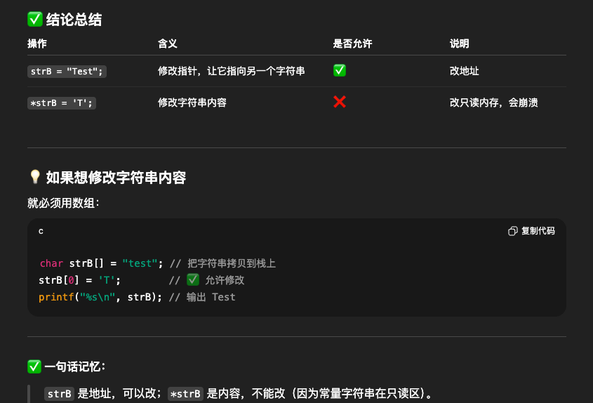

# 26 - 05 ｜ 指標與 const

切记：C语言中数组是不能直接被赋值的，也就是不能放在等号的左边，但是初始化好像可以，比如`int a[2] = {0}`

字符数组可以隐形的转成字符指针，如下`strA`是字符数组，那么`strA`也就是这个字符数组第1个元素的地址
```c++
    char strA[] = "test";
    printf("%c\n", *strA); // t
```


从`char *`转成`const char*`，原来是可读又可写，现在只是可读了



推荐使用`const char *strB`而不是`char *strB`



C语言中常量区定义
- 在C语言中，字符串常量通常放在程序的常量区，这个区域是编译器在生成可执行文件时划分出来的，只能读不能写


继续理解：



个人思考的问题：


深入理解：那么我可以改变`strB`的指向，也就是`strB = "Test"`


可以更改`strB`指向


总结：


