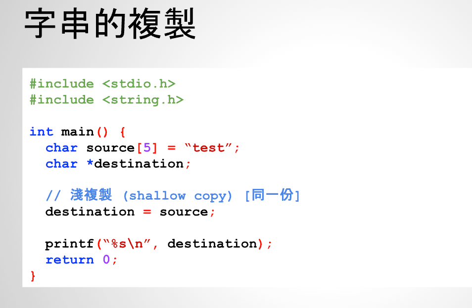
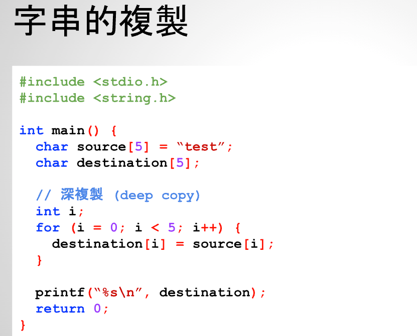
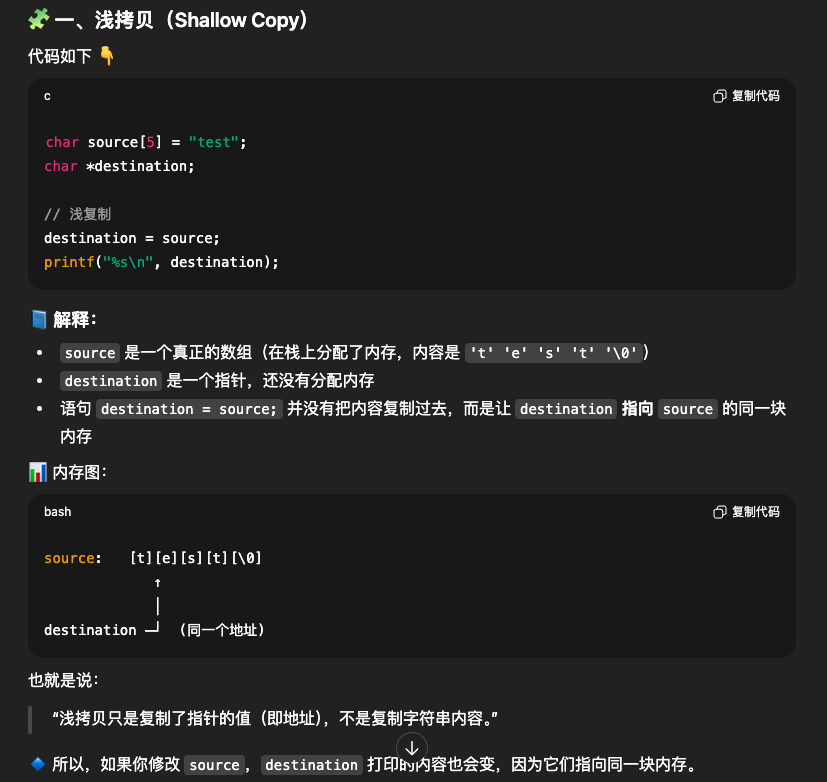
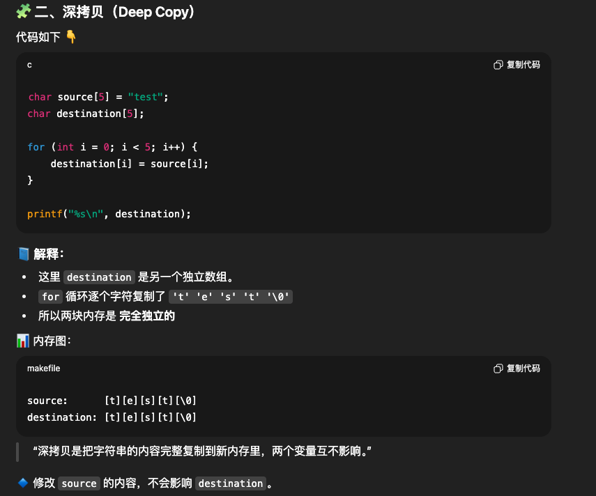
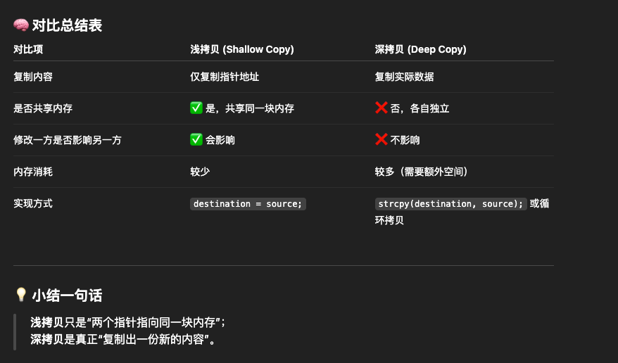
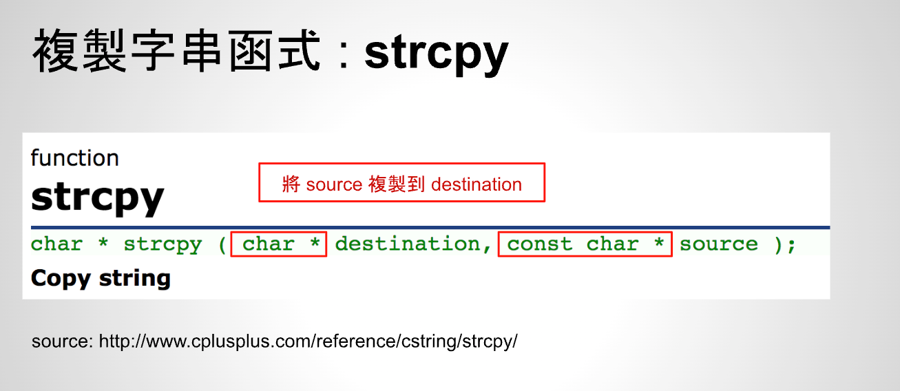

# 26 - 06 ｜ 使用函式複製字串


## 打印字符串长度

```c++
    const char *source = "test";
    // 在64位系统中，指针大小是8字节，在ARM32系统中，指针大小是4字节
    printf("length: %d\n", sizeof(source));  // 8，得到的是指针的大小
    printf("length: %d\n", sizeof(*source));  // 1
    // 正确获得字符串长度的语法如下
    printf("length: %lu\n", strlen(source));  // 4
```


## 深拷贝和浅拷贝

浅拷贝：



深拷贝：


浅拷贝说明：



深拷贝说明：



浅拷贝和深拷贝对比说明：



## 使用strcpy复制字符串

strcpy等同于手动的for循环把一个字符串数组里面内容赋值给另外一个字符串

C语言中复制字符串的函数：
- 后面的source必须能读，所以是`const char*`
- 前面的destination必须能写，所以是`char *`



实践中：
- 注意`char *destination`这样定义是不能复制的，必须是`char destination[5]`这样才行
- 使用`strcpy`复制字符串
```c++
      const char *source = "test";
      char destination[5];
      strcpy(destination, source);
      printf("new string: %s\n", destination);
 ```
