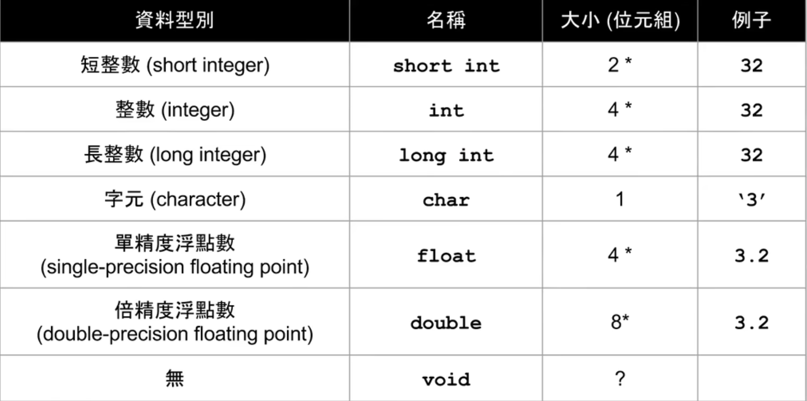
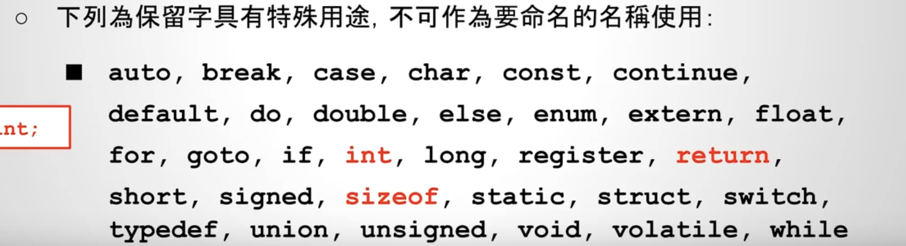

# 数据类型

基本概念：
- 电脑内部数据的储存是以字节（Byte）为单位组成，如下：

- 每个字节（Byte）一般是由8个比特位（bit）为单位组成
    - 每个字节一般由8个比特位组成
    - 每个比特位可以表示0或者1两种值
- 任何数据类型都可以转换成一串0和1组成的序列来表示

C语言常见的数据类型：

短整数short int：2字节
整数int：4字节
长整数long int：8字节
字符char：单字节
单精度浮点数float：4字节
双精度浮点数double：8字节

*表示在不同的编译器里面大小是不一样的

使用`sizeof()`查看数据类型在不同的系统和编译器中实际占用空间的大小，sizeof求出的返回值的单位是字节（Byte）

某些关键字不能用作变量名：

