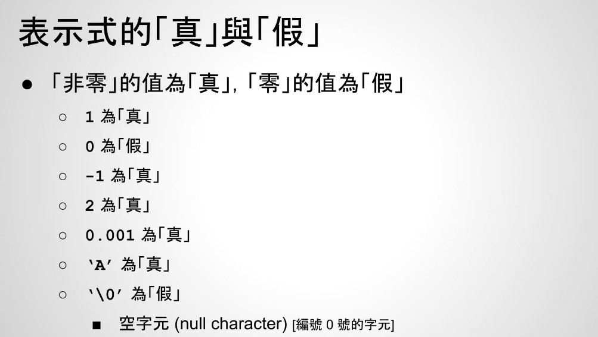

# viedo35-怎么判断是非对错

在C语言里面：
- 非0的值为真，0的值为假
  - 1为true，0为false，-1也是true，2也是true
  - 0.001为true，‘A’为真
  - 但是`\0`为false，空字节null character，注意字符串的结尾就是`\0`

在C语言中，字符串的结尾标志是 \0（空字符）。
- C字符串是以字符数组的形式存在的。
- 结尾的 \0 是一个字节，值为 0，表示字符串终止。
- 所有标准库函数（如 strlen、printf("%s")、strcpy 等）在处理字符串时，都会遇到 \0 就停止，不再继续处理后面的内容。

