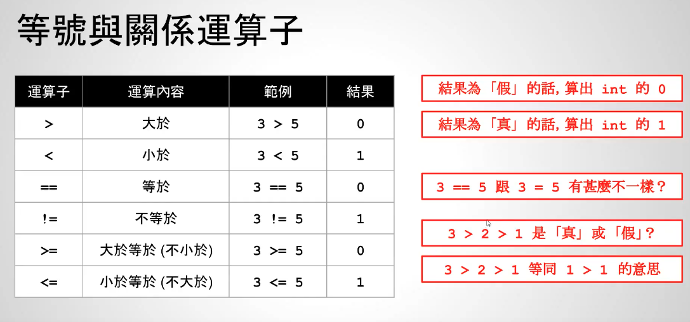

# viedo36-关系运算（重点）


在C语言中，结果为“假“的话，算出int的0；结果为真的话，可以输出int的1

输出结果：
```c++
    // result is: 0
    printf("result is: %d\n", 3 > 5);
    // result is: 1
    printf("result is: %d\n", 3 < 5);
    // result is: 0
    printf("result is: %d\n", 3 == 5);
    // result is: 1
    printf("result is: %d\n", 3 != 5);
    // result is: 0
    printf("result is: %d\n", 3 >= 5);
    // result is: 1
    printf("result is: %d\n", 3 <= 5);
```

思考下：3 > 2 > 1输出是？
- 从左往右计算，首先计算3 > 2为真，输出1
- 继续计算1 > 1，为假，输出0
```c++
    // result is: 0
    printf("result is: %d\n", 3 > 2 > 1);
```


在C语言中，做关系运算符操作的时候，只能从左往右2个2个的计算
